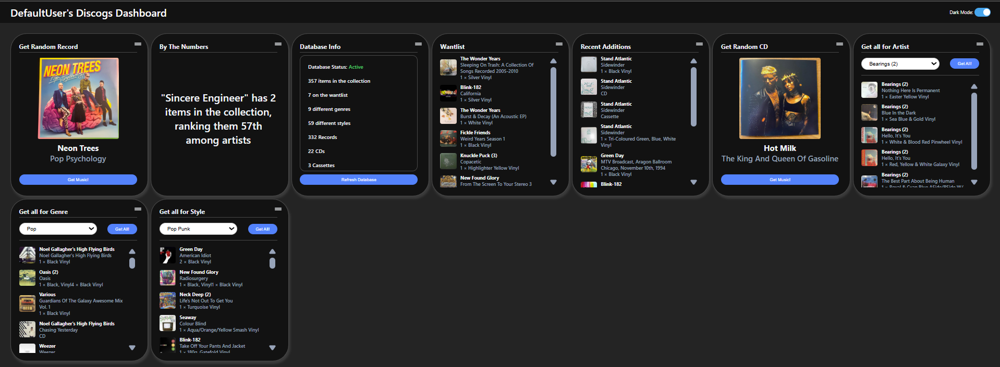

# Custom-Discogs-Dashboard - Deployment and Development Guide

This project involves a .NET 8 API backend paired with a React frontend to create a custom dashboard for a user's Discogs.com profile.



# Requirements
1. .NET 8 SDK
2. Node.js & npm
3. Kubernetes (Minikube, Docker Desktop, etc.)
4. kubectl, helm, and docker available in your terminal
5. Powershell

# Server

Written using .NET 8 and SQLite, providng a number of endpoints to server data to the Client. 

## Configuration

There is a general appsettings.json. And the gitignore excludes appsettings.Development.json for local dev usage.

When running from an IDE the API will run on http://localhost:8080

```json
{
  "DiscogsUsername": "",               // Your Discogs username
  "DiscogsToken": "",                  // Your Discogs API token (Do not commit!)
  "UserAgent": "",                     // A custom User-Agent for API requests
  "Logging": {
    "LogLevel": {
      "Default": "Information",        // General logging level
      "Microsoft.AspNetCore": "Warning" // ASP.NET Core-specific logging level
    }
  },
  "ConnectionStrings": {
    "DefaultConnection": "Data Source=/data/sqlite.db" // SQLite database path
  },
  "AllowedHosts": "*"                 // Allows all hosts (wildcard)
}
```

## API

#### 'GET /import'
- Builds the Collection, Wantlist, Genre and Styles table by getting the user's collection and wantlist from the Discogs.com API

#### 'GET /status'
- Returns information on the current DB. How many items are in each table, along with a DB status which will read Active, Empty or Disconnected

#### `GET /collection/random/vinyl`
- Return a random item from the collection table that has it's format tagged as Vinyl

#### `GET /collection/random/cd`
- Return a random item from the collection table that has it's format tagged as CD

#### 'GET /collection/recent/{numOfItems}'
- Return the most recent X number of items added to the collection

#### 'GET /getall/artist/{artistName}'
- Return all items in the collection for the given artist name

#### 'GET /collection/getall/genre/{genreName}'
- Return all items in the collection for the given genre

#### 'GET /collection/getall/style/{styleName}'
- Return all items in the collection for the given style

#### `GET /info/artists`
- Return a distinct list of all artists in the collection

#### `GET /info/styles`
- Return a distinct list of all styles in the collection

#### `GET /info/genres`
- Return a distinct list of all genres in the collection

#### `GET /info/fact`
- Return a random fact about the DB. Releases for a given artist/style/genre,or how many releases were added in a random month/year

#### `GET /wantlist`
- Returns all items in the Wantlist table

# Client

Bootstrapped using: https://create-react-app.dev/

The client is a single page application that present numerous grid components that can be moved and rearranged as desired. It is straight forward to add new components to explain the functionality of the dashboard. 

At the time of writing there are 9 existing components:
1. List all items in the wantlist
2. List the 10 most recent collection items
3. Get a random Vinyl
4. Get a random CD
5. Generate a random fact about the DB
6. Display the Status of the DB
7. Get all artists in the collection
8. Get all genres in the collection
9. Get all styles in the collection

## Configuration    

```
  REACT_APP_API_BASE_URL=https://localhost:8080 // URL of the server
  REACT_APP_USERNAME=Joe Bloggs // Displayed name on the dashboard
```

## Running the Client

Run these commands to start the application in a development environment. The app will run on localhost:3000

1. `npm install`
2. `npm start`

# Deployment

These apps come with Dockerfiles and individual sets of Helm charts

## Client Helm Charts

Values.yaml:

```yaml
replicaCount: 1

image:
  repository: discogs-client
  tag: latest
  pullPolicy: IfNotPresent

service:
  type: ClusterIP
  port: 80

ingress:
  enabled: true
  className: nginx
  annotations:
    nginx.ingress.kubernetes.io/rewrite-target: /
  hosts:
    - host: discogs.client.local
      paths:
        - path: /
          pathType: Prefix
env:
  REACT_APP_API_BASE_URL: "http://discogs.server.local"
  REACT_APP_USERNAME: "Joe Bloggs"
resources: {}
```


## Server Helm Charts

Values.yaml:
``` yaml
replicaCount: 1

image:
  repository: discogs-server
  tag: latest
  pullPolicy: IfNotPresent

service:
  type: ClusterIP
  port: 8080

persistence:
  enabled: true
  storageClass: standard
  accessMode: ReadWriteOnce
  size: 10Gi

config:
  DiscogsUsername: ""
  UserAgent: "MyDiscogsApp/1.0"
  Logging:
    LogLevel:
      Default: "Information"
      Microsoft.AspNetCore: "Warning"
  AllowedHosts: "*"

existingSecret:
  name: discogs-token
  key: token

ingress:
  enabled: true
  className: nginx
  hosts:
    - host: discogs.server.local
      paths:
        - path: /
          pathType: Prefix
```

## Token Secret

For security purposes your Discogs API token should *not* be entered via helm chart. Instead create a Kubernetes secret using it:

`kubectl create secret generic discogs-token --from-literal=token='MyToken'`

You can customise the name of this, and update the matching name in the server values.yaml

## Scripts

3 Scripts are included to assist with building the Docker images and deploying via Helm

1. BuildAndDeployServer.ps1
   - Builds the docker image for the server
   - Uninstalls any existing discogs-server deployment
   - Install discogs-server
3. BuildAndDeployClient.ps1
   - Builds the docker image for the client
   - Uninstalls any existing discogs-client deployment
   - Install discogs-client
5. DeployWithToken.ps1
   - Creates the Kube secret from a passed in value
   - Runs scripts 1 and 2
  
# TODO

- [ ] Add E2E backend tests
- [ ] Add Frontend tests
- [ ] Automate deployment to local server on master push
